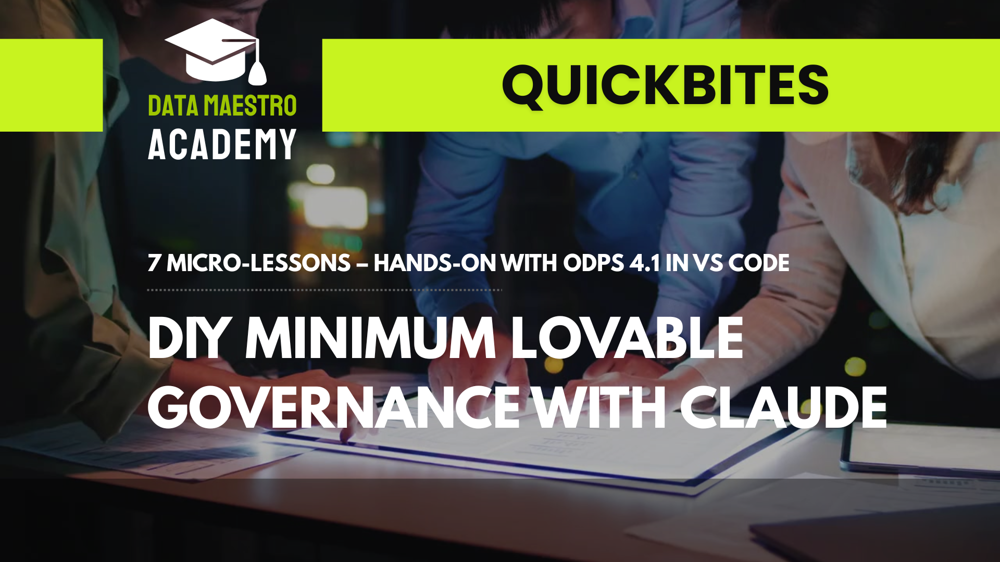

# DIY Minimum Lovable Governance (MLG) – GitHub-Managed Data Product Governance with Claude in VS Code

Learn how to build an AI-assisted, GitHub-governed data product governance model using the Open Data Product Specification (ODPS). This setup shows how Claude in VS Code can generate, validate, and refine ODPS-compliant YAML specs using local schemas and soft guardrails.

Season 1 - Each week adds a new building block:
* E1 – [Setup & Minimal Data Product (Claude + ODPS schema)](https://www.youtube.com/watch?v=h4VXAHImTjQ)
* E2 – [Product Strategy (value, KPIs, alignment)](https://www.youtube.com/watch?v=FZSu_0OfI_U)
* E3 – [Data Contracts (internal use and reuse)](https://www.youtube.com/watch?v=ZgO-Kc0rKcE)
* E4 – [Reusable Data Quality Library (base for multiple data products)](https://www.youtube.com/watch?v=16Rl02aFekc)
* E5 – [Reusable SLA Library](https://www.youtube.com/watch?v=dh6bhCQvKzM)
* E6 – [Access Profiles Library](https://www.youtube.com/watch?v=5gkulj5ys_o)
* E7 – Pricing
* BONUS: Recap what was done and how to proceed

## Includes:

* Full ODPS 4.1 schema and examples
* Project rule file for AI behavior guidance
* VS Code settings for real-time YAML validation
* Quickbite path for DIY MLG framework (Strategy, Contracts, DQ, SLA, Access, Pricing, Licensing)

## Get Certified in Minimum Lovable Governance

Built and documented by Dr. Jarkko Moilanen, creator of ODPS and the Minimum Lovable Governance model for data products.
The Minimum Lovable Governance Masterclass takes you beyond the QuickBites. It provides:

* Full walkthrough of all MLG components (Strategy, Contracts, DQ, SLA, Access, Pricing, Licensing)
* Real-world examples and reusable templates
* Official Data Maestro Academy certification recognized by global partners like Alation in their 10,000 Data Product Managers program

**Enroll today:** [Minimum Lovable Governance Masterclass in Udemy](https://www.udemy.com/course/data-products-minimum-lovable-governance-masterclass/?referralCode=3A5188B67577CFBC0B18)
